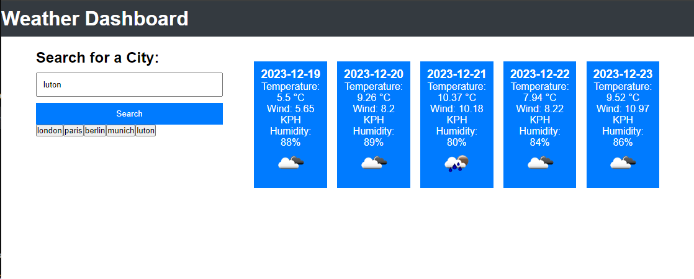

# Weather Dashboard

## Description

The Weather Dashboard is a web application that provides travelers with real-time weather outlooks for multiple cities. By entering a city into the search field, users can plan their trips according to current and future weather conditions. The application features a clean, user-friendly interface that displays weather conditions, including temperature, humidity, and wind speed, as well as a 5-day forecast.

## Features

- **City Search**: Users can search for a city to get the current weather condition and a 5-day weather forecast.
- **Weather Details**: Displays the city name, date, weather condition icon, temperature, humidity, and wind speed.
- **5-Day Forecast**: Presents a forecast for the next five days, including weather condition icons, temperature, and humidity.
- **Search History**: Saves and displays the user's search history for quick re-evaluation of previously looked-up cities.

## How to Use

1. Enter a city name into the search bar.
2. Click on the 'Search' button or press 'Enter' to submit.
3. View the current weather conditions and 5-day forecast for the selected city.
4. Click on a city name from the search history to quickly access its weather details again.

## Installation

To set up the Weather Dashboard locally, follow these steps:

1. Clone the repository to your local machine.
2. Open the `index.html` file in a web browser to start the application.

## Technologies Used

- HTML
- CSS
- JavaScript
- OpenWeatherMap API

## Contributions

Contributions are welcome. Please fork the repository and open a pull request with your updates.

## License

This project is licensed under the MIT License - see the LICENSE file for details.
## Deployment link
https://georgeionite.github.io/Weather-Forecast/

## Screenshot 

